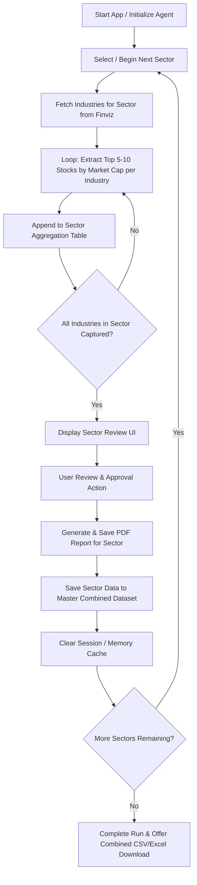

# Specification: Sector Industry Leaders Agent App (v2)

## 1. Overview & Purpose
The **Sector Industry Leaders Agent App (v2)** is a Python-based web application designed to systematically identify, curate, and review top stock symbols across all market sectors and industries listed on **Finviz.com**. 

The application utilizes an intelligent scraping or automated research agent to extract market-cap ranked constituents (top 5 to 10 stocks) for every industry within each sector. It presents findings sector-by-sector in a user-interactive web environment for review, approval, export (PDF & Combined CSV/Excel), and cache management.

---

## 2. Key Objectives & Functional Requirements

### 2.1 Agent Data Extraction & Scraper Engine
- **Target Source**: Finviz (`finviz.com`) groups stocks by **Sector** and **Industry**.
- **Extraction Logic**:
  1. For each Sector (e.g., *Communication Services*), identify all associated Industries (e.g., *Advertising Agencies*, *Broadcasting*, *Entertainment*, etc.).
  2. For each Industry, retrieve the top 5 to 10 constituent stock ticker symbols ordered by **Market Capitalization** (descending).
  3. Example target data layout:
     - **Sector**: Communication Services
     - **Industry**: Advertising Agencies
     - **Top Stock Symbols**: `APP`, `OMC`, `TTD`, `WPP`, `MGNI`, `LFTO`, `DV`, `STGW`, `ZD`, `CCO`

### 2.2 Table Compilation & Iterative Aggregation
- Maintain an aggregation table containing the fields:
  - `Sector`
  - `Industry`
  - `Stock Symbols` (comma-separated or formatted list)
- Cycle sequentially through all industries within a single sector, continually appending newly retrieved records to the sector overview table.

### 2.3 Interactive User Review & Human-in-the-Loop Approval
- **Sector-Level Checkpoints**: Once all industries within a single sector have been processed, pause processing and display the full captured table for that sector.
- **Review UI**:
  - Show the sector's complete breakdown of industries and top 5–10 stocks.
  - Allow user modification/editing or direct approval via UI action buttons.

### 2.4 Export Options, Cache Cleansing & Execution Flow
- **PDF Export**: Upon explicit user approval of a completed sector:
  - Export and save the finalized sector data into a clean, formatted PDF report (`output_reports/{Sector}_Leaders.pdf`).
- **Combined Export**:
  - Maintain a master multi-sector repository allowing instant export of all processed sectors to a combined **CSV** or **Excel** file.
- **Cache Management**:
  - Clear the runtime/session cache after saving to prevent memory bloat and eliminate cross-sector data leakage.
- **Sequential Continuation**:
  - Automatically advance to process the next sector in sequence once the current sector has been saved and cache cleared.

---

## 3. Recommended Architecture & Technology Stack

- **Backend / Core Logic**: Python 3.10+
- **Data Scraping / Gathering**: `BeautifulSoup4` / `requests` or Finviz API wrapper.
- **Web UI Framework**: Streamlit for responsive interactive web control.
- **Export Engine**: `ReportLab` for generating PDF reports, `Pandas` for CSV/Excel exports.
- **Data Model**: Pandas DataFrames / Pydantic schemas for data validation and tabular management.

---

## 4. User Workflow & Execution Diagram

